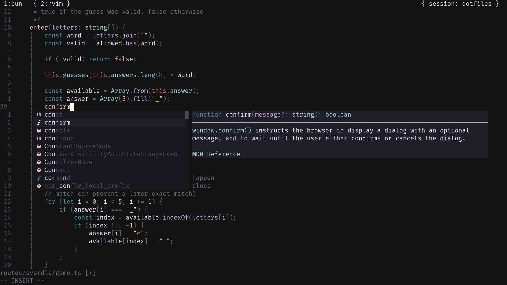

## [Rosé Pine](https://github.com/rose-pine/neovim) but optimized for my retinas :)

<div align="center">
 
</div>

> [!TIP]
> Only the main variant is customised, hence the variants dawn, moon remains the same.

## Installation

> [!NOTE]
> **vim.pack** requires neovim 0.12+

[vim.pack](https://neovim.io/doc/user/pack.html#_plugin-manager)

```lua
vim.pack.add({
    { src = "https://github.com/TheRootDaemon/rose-pine", name = "rose-pine" }
})

```

[lazy.nvim](https://github.com/folke/lazy.nvim)

```lua
{ "TheRootDaemon/rose-pine", name = "rose-pine", priority = 1000 }
```

[mini.deps](https://github.com/echasnovski/mini.nvim/blob/main/readmes/mini-deps.md)

```lua
add({ source = "TheRootDaemon/rose-pine", name = "rose-pine" })
```

[packer.nvim](https://github.com/wbthomason/packer.nvim)

```lua
use { "TheRootDaemon/rose-pine", as = "rose-pine" }
```

## Usage

```lua
require('rose-pine').setup()
vim.cmd('colorscheme rose-pine')
```

